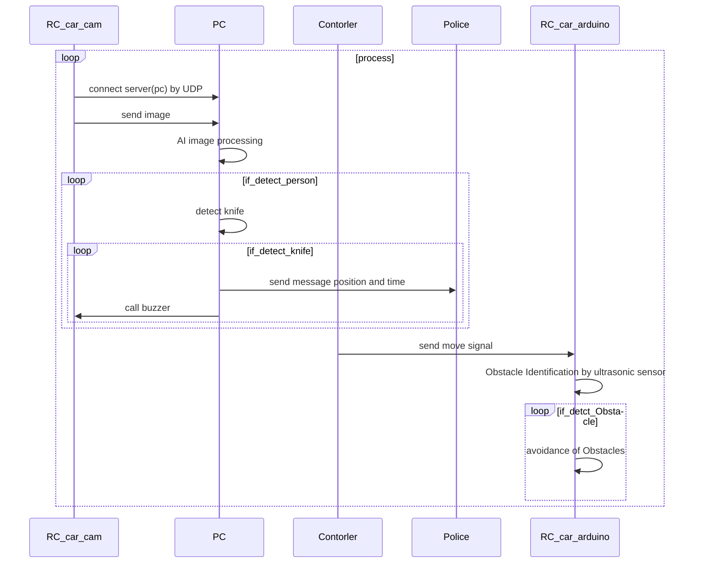

# result-aiot
2023한강 aiot대회 참가 프로그램

this project is detect person and knife by moblienet V2


rc_car.py
```py
pip install serial
pip install opencv-python
pip install GPIO
```
detection.py
```py
pip install numpy
pip install Twilio
pip install opencv-python
```


